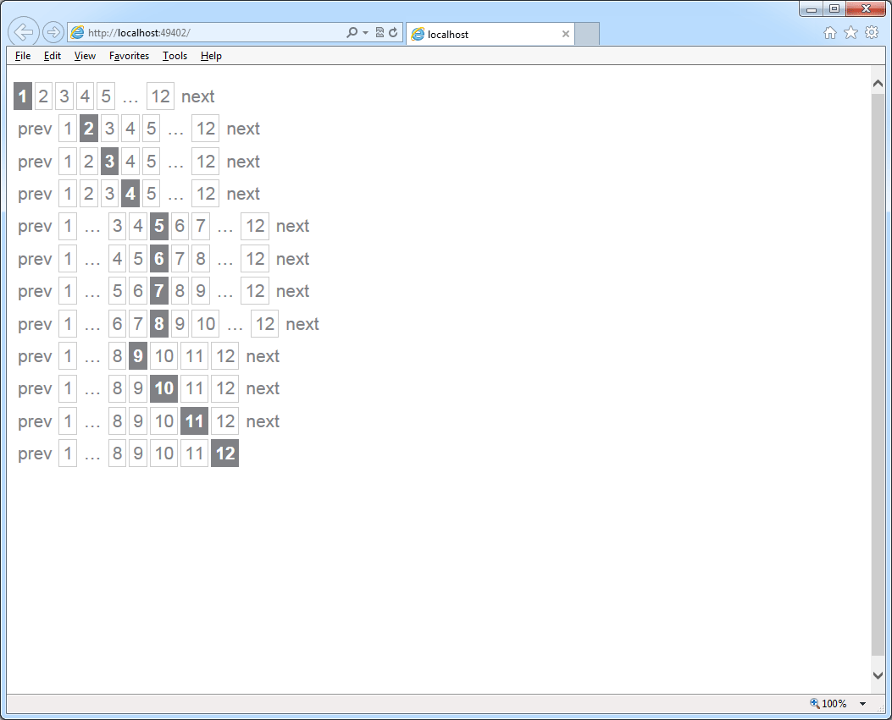
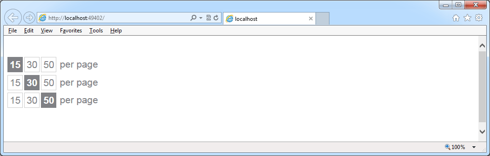

WebHelpers
==========

Paging - like stackoverflow

Paging
------

    @Html.SimplePager(CurrentPage, PageCount, Url, CssClass);
    // Url: {0} gets replaced with selected page
	// CssClass: class assigned to wrapping div

    @Html.SimplePager(CurrentPage, PageCount, "/Home/?page={0}", "pager");

Page Size
----

    @Html.SimplePageSize(Url, CurrentPagesize, PageCount, Css);
    // Url: {0} gets replaced with selected pagesize
	// CssClass: class assigned to wrapping div

    @Html.SimplePageSizer("/Home/?pagesize={0}", CurrentPagesize, PageCount, "page-sizer");
    

