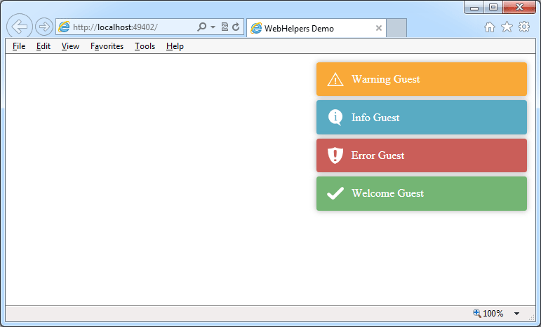

WebHelpers
==========

+ Paging - like stackoverflow
+ Notifications 

Notifications
-------------

Uses the Javascript library toastr from [https://github.com/CodeSeven/toastr](https://github.com/CodeSeven/toastr)

Controller:

    using dks.Web.Extensions;

    public class HomeController : Controller
    {
        //
        // GET: /Home/
        public ActionResult Index()
        {

			this.AddNotification("Welcome Guest");
            return View();
        }      
    }

View:

    <link href="~/content/toastr.css" rel="stylesheet" />
	
	

    @Html.RenderToasts()

Paging
------

    @Html.SimplePager(CurrentPage, PageCount, Url, CssClass);
    // Url: {0} gets replaced with selected page
	// CssClass: class assigned to wrapping div

    @Html.SimplePager(CurrentPage, PageCount, "/Home/?page={0}", "pager");

Page Size
----

    @Html.SimplePageSize(Url, CurrentPagesize, PageCount, Css);
    // Url: {0} gets replaced with selected pagesize
	// CssClass: class assigned to wrapping div

    @Html.SimplePageSizer("/Home/?pagesize={0}", CurrentPagesize, PageCount, "page-sizer");
    

